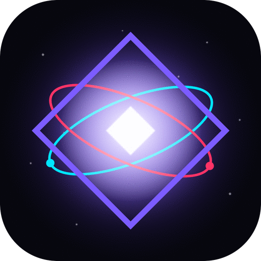

<p align="center">
  
</p>

<h1 align="center">◈ QUART</h1>
<p align="center"><em>Quantum Drawing Engine</em></p>

<p align="center">
A next-generation drawing & animation app for the Galaxy Tab S10+, built on a quantum-mechanical core. $0.99 on Google Play.
</p>

---

## Core Philosophy

Quart treats every brush stroke as a quantum wavefunction. Particles have position uncertainty, colors exist in superposition until observed, and undo/redo are literal "quantum jumps" through state space. Nothing is generic.

## Key Features

### 🎨 Quantum Brush Engine
- **Path-integral Pen** — strokes follow the principle of least action, with quantum smoothness
- **Wavefunction Brush** — each bristle is a particle in a probability cloud
- **Probability Airbrush** — Gaussian spray following quantum measurement distributions
- **Graphite Pencil** — grain particles with Heisenberg uncertainty
- **Quantum Vacuum Eraser** — not just removing, but tunneling through pixels
- **Wavefunction Smudge** — collapses neighbor colors into your stroke
- **Entangled Fill** — quantum flood fill with tunneling through near-matching edges

### ⏱️ Circular Chronos Timeline
- No more left-to-right linear timeline — Chronos is an expanding circular puck
- Scrub frames by rotating the ring
- Expand to reveal frame thumbnails along the orbital ring
- Playback, onion skinning, add/duplicate frames
- Configurable FPS (6/8/12/15/24/30)

### 🎯 Floating Round Pucks
Every tool is a draggable, glassmorphic circular puck you can position anywhere:
- **CHRONOS** — timeline (bottom center)
- **FORGE** — brushes & properties (left side)
- **SPECTRUM** — color wheel + quantum-entangled Copic palette (right side)
- **ORBITS** — layers with live thumbnails (right bottom)
- **QUANTUM** — themes & engine settings (left bottom)
- **EXPORT** — PNG, PSD, MP4, GIF, WebP, QPF (left top)
- **◈ Central Orb** — double-tap for new canvas, single-tap for quantum color jump

### 🌈 Entangled Themes & Copic Palette
Changing the canvas theme *physically shifts the Copic marker palette* through HSL entanglement. Seven built-in themes:
- **Void** (deep space black/purple)
- **Nebula** (violet cosmic clouds)
- **Plasma** (hot red/orange)
- **Quantum** (cool blue/cyan)
- **Aurora** (green northern lights)
- **Cream** (warm off-white paper)
- **Paper** (bright natural white)

### 🎬 Animation Features (from Procreate Dreams, ToonSquid, ToonBoom)
- Frame-by-frame animation with onion skinning (previous + next frame with different blend)
- Live frame thumbnails on circular timeline
- Layer-based compositing
- Playback scrubbing by rotating the Chronos puck
- Export to GIF, WebM/MP4, WebP stickers, layered PNGs, and native QPF project files

### ✨ UX Details
- **Transparent glassmorphic UI** — all panels are frosted-glass circles
- **Magnetic edge snapping** for pucks
- **S Pen pressure support** — pressure maps to both size and opacity
- **Two-finger pinch zoom & pan**
- **Tap outside any puck** to instantly collapse all panels
- **Keyboard shortcuts** (B=brush, P=pen, E=eraser, F=fill, space=play, N=onion, Ctrl+Z=undo)
- **Pentatonic quantum UI sounds** via Web Audio
- **Animated quantum field background** with entangled particles that react to touch

### 💾 Export
- **PNG** — flattened current frame
- **PSD-style** — each layer as separate PNG
- **MP4/WebM** — animated loop
- **GIF** — animated loop
- **WebP** — sticker with transparency (no background)
- **QPF** — native Quart Project File (JSON + PNG layers, fully reimportable)

## Project Structure

```
Quart/
├── index.html              # App entry
├── manifest.json           # PWA manifest for Play Store wrapping
├── assets/
│   ├── icon-192.png
│   └── icon-512.png
└── src/
    ├── styles/
    │   └── main.css        # Full transparent/glassmorphic theme
    ├── quantum/
    │   ├── engine.js       # Quantum mechanics core (wavefunctions, HBAR, path integrals)
    │   ├── particles.js    # Background quantum field
    │   └── audio.js        # Pentatonic quantum UI sounds
    ├── themes/
    │   └── copic.js        # Copic palette + quantum theme entanglement
    ├── canvas/
    │   ├── brushes.js      # All 8 quantum brush types
    │   ├── renderer.js     # Layer compositing, undo/redo, input
    │   └── animation.js    # Frame timeline + onion skinning
    └── ui/
        ├── puck.js         # Draggable/expandable puck system
        ├── timeline-puck.js
        ├── palette-puck.js
        ├── tool-puck.js
        ├── layer-puck.js
        ├── export-puck.js
        └── central-orb.js
```

## Building for Google Play

1. Wrap as TWA (Trusted Web Activity) using Bubblewrap:
   ```bash
   npm install -g @bubblewrap/cli
   bubblewrap init --manifest=https://your-deploy-url/manifest.json
   bubblewrap build
   ```
2. Upload the generated `.aab` to Google Play Console
3. Price: $0.99 one-time purchase (no subscriptions, no IAP)

## Local Development

Serve the directory with any static server:

```bash
npx serve .
# or
python3 -m http.server 8080
```

Open in Chrome on a tablet/desktop for the full experience. Optimized for Galaxy Tab S10+ (1752×2800, 120Hz, S Pen pressure support).

## Physics Easter Eggs

- The quantum constant `HBAR = 2.4` controls brush jitter magnitude
- Color superposition shifts hues with a Doppler-like effect based on stroke velocity
- The central orb's rings rotate at different angular velocities (like electron orbitals)
- Undo is literally "collapsing the wavefunction" to a previous state
- Fill uses quantum tunneling — there's a 0.5% chance paint leaks through edges

## License

© 2026 Quart. All rights reserved.
